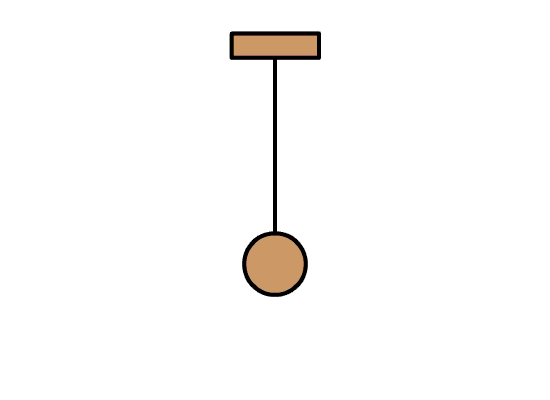
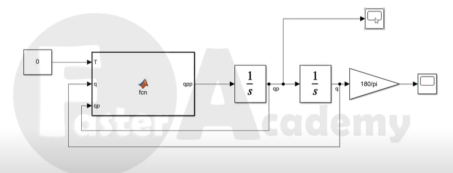

# Péndulo

Para poder ejemplificar y entender mejor el cómo funciona un sistema continuo, escogimos un el sistema de un pendulo.

El **péndulo** ​es un sistema físico que puede oscilar bajo la acción gravitatoria u otra característica física y que está configurado por una masa suspendida de un punto o de un eje horizontal fijos mediante un hilo, una varilla, u otro dispositivo que pueda mantener fijo el sistema.

 
**Imagen de un péndulo simple**

Al ver el sistema del péndulo, podemos percatarnos que se mantendrá en movimiento continuo hasta que otra fuerza se encargue de detenerlo.
<a href="https://www.youtube.com/watch?v=eTEIu0Z3Q6U&ab_channel=FasterAcademy" target="_blank">Video explicativo para simular un pendulo simple en Simulink.</a>

**Simulador de un péndulo simple en Simulink**

Simulador de un péndulo simple:

<iframe id="inlineFrameExample" title="Inline Frame Example" width="920" height="880"
                src="https://phet.colorado.edu/sims/html/pendulum-lab/latest/pendulum-lab_es.html">
</iframe>

