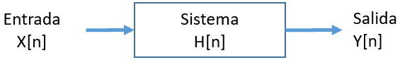

# Sistema Discreto
Cuando las entradas de tiempo son muestras discretas se transforman en salidas de tiempo discreto, al sistema se denomina **sistema discreto**.
Simbólicamente se representa como:

Por ejemplo un filoscopio, flipbook o libro animado usa entradas y salidas de tiempo discretas.
